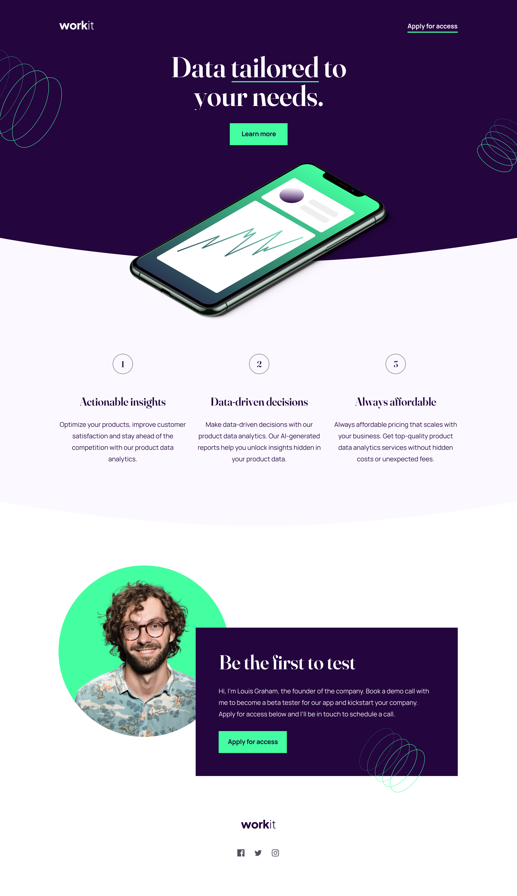

# Frontend Mentor - Workit landing page solution

This is a solution to the [Workit landing page challenge on Frontend Mentor](https://www.frontendmentor.io/challenges/workit-landing-page-2fYnyle5lu). Frontend Mentor challenges help you improve your coding skills by building realistic projects.

## Table of contents

- [Overview](#overview)
  - [The challenge](#the-challenge)
  - [Screenshot](#screenshot)
  - [Links](#links)
- [My process](#my-process)
  - [Built with](#built-with)
  - [What I learned](#what-i-learned)
  - [Useful resources](#useful-resources)
- [Author](#author)
- [Acknowledgments](#acknowledgments)

## Overview

### The challenge

Users should be able to:

- View the optimal layout for the interface depending on their device's screen size
- See hover and focus states for all interactive elements on the page

### Screenshot

### Links

- Solution URL: [Github Repository](https://github.com/simokitkat/Workit-landing-page)
- Live Site URL: [Frontend Mentor | Workit landing page](https://workit-landing-page-frontendmentor.netlify.app)

## My process

### Built with

- Semantic HTML5 markup
- SCSS
- Flexbox
- Grid
- [React](https://reactjs.org/)
- Vite

### What I learned

This my first project where I used Vite instead of CRA and I really enjoyed its speed.

### Useful resources

- [Learn React 18 with Redux Toolkit – Full Tutorial for Beginners](https://youtu.be/2-crBg6wpp0) - This helped me start working with react and honestly I like the way the instructor of this course, John Smilga, explains the basic concepts of React, making it possible for begginers to start building their projects using it.

## Author

- [Frontend Mentor](https://www.frontendmentor.io/profile/simokitkat)
- [Linkedin](https://www.linkedin.com/in/islamsoliman92)

## Acknowledgments

A huge Thank you for Free Code Camp for their free courses that really helped me and still continue to help me learn new stuff everyday.
